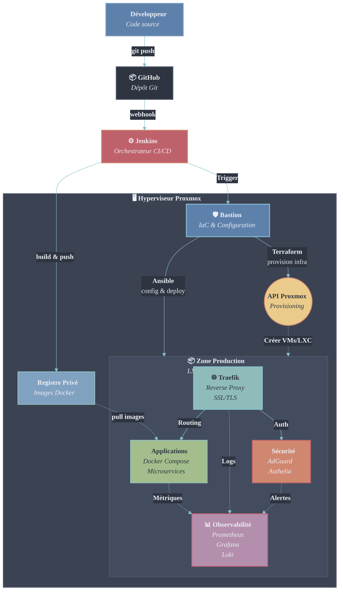

# 🏰 Infrastructure Homelab de Niveau Entreprise

> **Infrastructure as Code (IaC) · Pipelines CI/CD · Observabilité Complète sur Proxmox**

[](https://www.terraform.io/)
[](https://www.ansible.com/)
[](https://www.jenkins.io/)
[](https://www.docker.com/)
[](https://traefik.io/)
[](https://grafana.com/)
[](LICENSE)

---

## 📖 Présentation

Ce projet démontre une **infrastructure de niveau production** fonctionnant dans un environnement homelab. Il réplique les standards et contraintes d'entreprise en utilisant des pratiques et outils DevOps modernes.

### 🎯 Principes Fondamentaux

**"Everything as Code"** — Zéro configuration manuelle des serveurs. Si un serveur tombe, il peut être automatiquement redéployé depuis le code.

| Pilier | Implémentation |
|--------|---------------|
| **Immutabilité** | Infrastructure définie de manière déclarative avec Terraform |
| **Automatisation** | Gestion de configuration via playbooks Ansible |
| **Livraison Continue** | Déploiements zéro-clic via pipelines Jenkins |
| **Observabilité** | Stack de monitoring complète (Logs + Métriques + Traces) |
| **Sécurité** | Isolation réseau, conteneurs non-privilégiés, gestion des secrets |

---

## 🏗️ Vue d'Ensemble de l'Architecture

L'infrastructure fonctionne sur **Proxmox VE** avec un nœud **Bastion** dédié orchestrant tous les déploiements. Aucun accès direct aux nœuds de production n'est nécessaire.



---

## 🛠️ Stack Technologique

### Couche Infrastructure

| Composant | Technologie | Objectif |
|-----------|-----------|---------|
| **Provisioning** | Terraform | Gestion du cycle de vie des conteneurs LXC (état stocké sur Bastion) |
| **Configuration** | Ansible | Hardening OS, installation Docker, gestion utilisateurs, rotation logs |
| **Hyperviseur** | Proxmox VE | Hyperviseur Type-1 pour orchestration LXC et VM |

### Couche Application

| Composant | Technologie | Objectif |
|-----------|-----------|---------|
| **CI/CD** | Jenkins | Pipelines déclaratives (DSL Groovy) pour infra et apps |
| **Orchestration** | Docker Compose | Gestion d'applications multi-conteneurs |
| **Réseau** | Traefik v3 | Reverse proxy dynamique avec SSL/TLS automatique |
| **Registre** | Docker Registry | Stockage privé d'images avec authentification |

### Sécurité & Monitoring

| Composant | Technologie | Objectif |
|-----------|-----------|---------|
| **VPN** | Tailscale | Réseau mesh sécurisé pour l'administration |
| **Secrets** | Ansible Vault | Gestion chiffrée des identifiants |
| **Métriques** | Prometheus + Node Exporter | Collecte de métriques time-series |
| **Visualisation** | Grafana | Dashboards unifiés pour la santé de l'infrastructure |
| **Logs** | Loki (prévu) | Agrégation centralisée des logs |

---

## 🚀 Architecture des Pipelines CI/CD

Le projet implémente des **pipelines séparés** pour les cycles de vie infrastructure et applications.

### 🔵 Pipeline Application (Intégration Continue)

Déclenché lors de modifications du code applicatif (ex: Budget App).

```
┌─────────────┐     ┌──────────┐     ┌─────────┐     ┌──────────────┐
│  Git Push   │ ──> │  Build   │ ──> │  Tests  │ ──> │ Push vers    │
│             │     │  Docker  │     │  Units  │     │ Registre     │
└─────────────┘     └──────────┘     └─────────┘     └──────────────┘
```

**Étapes :**
1. **Build** — Création d'image Docker multi-stage
2. **Test** — Tests unitaires + validation linting
3. **Push** — Tag et publication de l'image vers le registre privé

### 🟢 Pipeline Infrastructure (Déploiement Continu)

Déclenché lors de modifications Terraform/Ansible.

```
┌─────────────┐     ┌──────────────┐     ┌────────────────┐     ┌──────────┐
│ Changements │ ──> │ Terraform    │ ──> │ Configuration  │ ──> │ Restart  │
│ Terraform   │     │ Plan/Apply   │     │ Ansible        │     │ Services │
└─────────────┘     └──────────────┘     └────────────────┘     └──────────┘
```

**Étapes :**
1. **Checkout** — Récupération du code infrastructure sur Bastion
2. **Plan/Apply** — Mise à jour ressources compute et topologie réseau
3. **Configure** — Exécution playbooks Ansible pour déploiement services
4. **Validate** — Health checks et tests de fumée

---

## 📊 Stack d'Observabilité

### Architecture Monitoring

```
┌──────────────────────────────────────────────────────┐
│               Dashboards Grafana                     │
│           (Visualisation Unifiée)                    │
└─────────────────┬────────────────────────────────────┘
                  │
        ┌─────────┴─────────┐
        ▼                   ▼
┌───────────────┐   ┌───────────────┐
│  Prometheus   │   │   InfluxDB    │
│  (Métriques)  │   │ (Time-series) │
└───────┬───────┘   └───────┬───────┘
        │                   │
        └─────────┬─────────┘
                  ▼
        ┌──────────────────┐
        │  Node Exporter   │
        │    Telegraf      │
        │ (Collecte Data)  │
        └──────────────────┘
```

### Métriques Clés Surveillées

- 📈 **Système** : CPU, RAM, I/O disque, débit réseau
- 🐳 **Conteneurs** : Utilisation ressources Docker, compteurs de restart
- 🌐 **Réseau** : Taux de requêtes Traefik, temps de réponse, taux d'erreur
- 💾 **Stockage** : Utilisation disque LXC, pools de stockage Proxmox

> **Note** : Ajoutez ici vos captures d'écran de dashboards Grafana pour présenter les données de monitoring réelles.

---

## 🔐 Implémentation Sécurité

La sécurité est intégrée dès la phase de conception (**Security by Design**).

### Stratégie de Défense en Profondeur

| Couche | Implémentation |
|-------|---------------|
| **Moindre Privilège** | Tous les conteneurs LXC fonctionnent en mode non-privilégié (pas de root sur l'hôte) |
| **Gestion Secrets** | Zéro identifiant en clair — chiffrement Ansible Vault |
| **Segmentation Réseau** | Zone production isolée du réseau de management |
| **Surface d'Attaque** | Seul le port 443 (HTTPS) exposé via Traefik |
| **Hardening SSH** | Authentification par clés uniquement, accès Bastion seul |
| **Accès Admin** | VPN mesh Tailscale — pas de port SSH 22 public |
| **Gestion Certificats** | Let's Encrypt automatisé via Traefik |

---

## 📦 Inventaire Infrastructure

| ID | Hostname | IP | vCPU | RAM | Rôle |
|----|----------|-------|------|-----|------|
| 99 | `bastion-admin` | 192.168.1.20 | 2 | 4GB | Control Plane · Terraform · Ansible |
| 200 | `traefik` | 192.168.1.30 | 2 | 2GB | Reverse Proxy · Terminaison SSL |
| 201 | `servarr` | 192.168.1.31 | 4 | 8GB | Serveur Applications · Docker Compose |
| 203 | `jenkins` | 192.168.1.33 | 2 | 4GB | Contrôleur CI/CD · Registre Docker |
| 204 | `monitoring` | 192.168.1.34 | 2 | 4GB | Prometheus · Grafana · Alerting |

---

## 🚀 Guide de Démarrage Rapide

### Prérequis

- Proxmox VE 8.0+ installé sur bare metal
- Git et clé SSH configurés
- Ansible 2.15+ sur votre machine locale

### Étape 1 : Bootstrap du Nœud Bastion

Depuis votre **poste de travail local** :

```bash
git clone https://github.com/votre-username/homelab-infrastructure.git
cd homelab-infrastructure/terraform/bastion

terraform init
terraform apply -auto-approve
```

### Étape 2 : Configuration Initiale

Connexion au Bastion et exécution du setup initial :

```bash
ansible-playbook -i inventory/bastion.yml playbooks/setup_bastion.yml --ask-vault-pass
```

### Étape 3 : Déploiement de l'Infrastructure Complète

Exécution du script de déploiement maître :

```bash
ssh root@bastion.votredomaine.com
cd /opt/homelab
./scripts/deploy_infrastructure.sh
```

### Étape 4 : Vérification du Déploiement

Vérification de la santé des services :

```bash
ansible all -i inventory/production.yml -m ping
docker ps --format "table {{.Names}}\t{{.Status}}"
```

Accès au dashboard Grafana : `https://monitoring.votredomaine.com`

---

## 📁 Structure du Dépôt

```
homelab-infrastructure/
├── ansible/
│   ├── playbooks/          # Scripts d'automatisation Ansible
│   ├── roles/              # Rôles Ansible réutilisables
│   └── inventory/          # Définitions des hôtes
├── terraform/
│   ├── bastion/            # Provisioning du nœud Bastion
│   ├── modules/            # Modules Terraform réutilisables
│   └── production/         # Définitions LXC production
├── jenkins/
│   ├── pipelines/          # Jenkinsfiles (Déclaratifs)
│   └── jobs/               # Configurations des jobs
├── docker/
│   ├── compose/            # Stacks Docker Compose
│   └── images/             # Dockerfiles personnalisés
├── monitoring/
│   ├── grafana/            # Définitions dashboards (JSON)
│   └── prometheus/         # Configurations scraping
└── docs/
    ├── architecture/       # Diagrammes d'architecture
    └── runbooks/           # Procédures opérationnelles
```

---

## 🎯 Roadmap

- [ ] **GitOps** : Migration vers ArgoCD pour livraison applicative déclarative
- [ ] **Service Mesh** : Évaluation Istio/Linkerd pour gestion trafic avancée
- [ ] **Stratégie Backup** : Intégration automatisée Proxmox Backup Server
- [ ] **Haute Disponibilité** : Ajout clustering Proxmox (setup 3 nœuds)
- [ ] **Observabilité** : Intégration Loki pour centralisation logs
- [ ] **Sécurité** : Implémentation Vault pour génération dynamique secrets

---

## 📚 Ressources & Documentation

- [Documentation Proxmox VE](https://pve.proxmox.com/pve-docs/)
- [Provider Terraform Proxmox](https://registry.terraform.io/providers/Telmate/proxmox/latest/docs)
- [Bonnes Pratiques Ansible](https://docs.ansible.com/ansible/latest/user_guide/playbooks_best_practices.html)
- [Syntaxe Pipeline Jenkins](https://www.jenkins.io/doc/book/pipeline/syntax/)

---

## 👤 Auteur

**Clément Trecourt**  
Ingénieur DevOps | Passionné d'Automatisation

[](https://www.linkedin.com/in/votre-profil)
[](https://github.com/votre-username)
[](mailto:votre.email@exemple.com)

---

## 📄 Licence

Ce projet est sous licence MIT — voir le fichier [LICENSE](LICENSE) pour plus de détails.

---

## 🙏 Remerciements

Construit avec passion pour l'automatisation et l'excellence infrastructurelle.

> *"L'automatisation n'est pas une fin en soi — c'est le moyen de dormir tranquille."*

---

<div align="center">
⭐ Mettez une étoile à ce dépôt si vous le trouvez utile ! ⭐
</div>