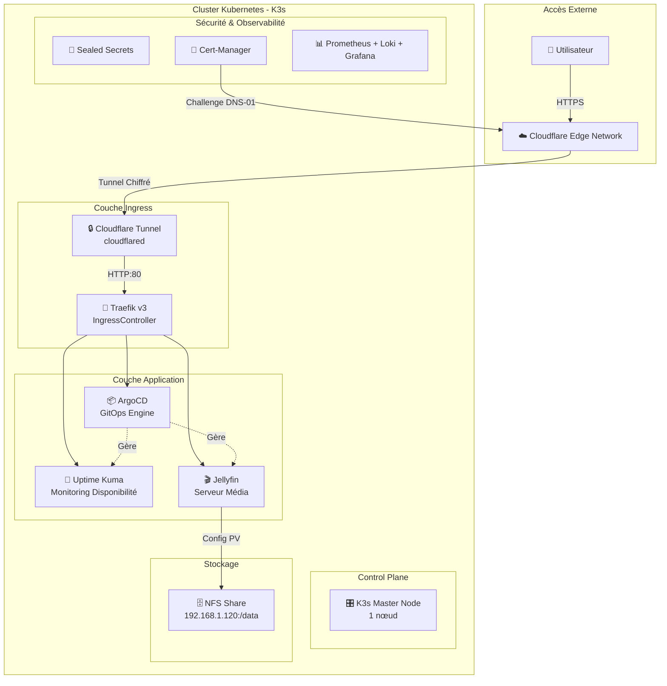
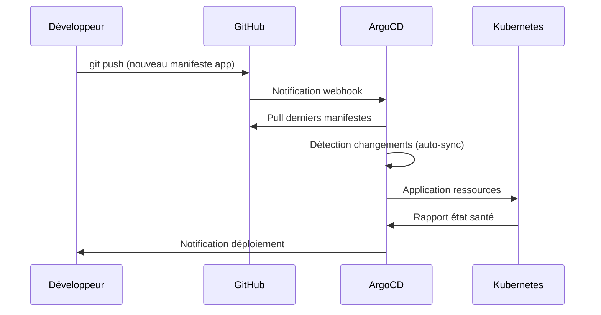

# 🚀 Plateforme GitOps Production - Homelab K3s

[](https://terraform.io)
[](https://ansible.com)
[](https://k3s.io)
[](https://argoproj.github.io/argo-cd/)
[](https://cloudflare.com)

> **Infrastructure Kubernetes de niveau entreprise démontrant les pratiques DevOps en production dans un environnement homelab à ressources limitées**

---

## 📋 Table des Matières
- [Vue d'Ensemble](#-vue-densemble)
- [Réalisations Techniques](#-réalisations-techniques)
- [Architecture](#-architecture)
- [Stack Technologique](#-stack-technologique)
- [Infrastructure as Code](#-infrastructure-as-code)
- [Implémentation Sécurité](#-implémentation-sécurité)
- [Workflow GitOps](#-workflow-gitops)
- [Démarrage Rapide](#-démarrage-rapide)
- [Optimisations Performance](#-optimisations-performance)
- [Compétences Démontrées](#-compétences-démontrées)
- [Contact](#-contact)

---

## 🎯 Vue d'Ensemble

Ce dépôt présente une **infrastructure Kubernetes entièrement automatisée et prête pour la production**, construite de zéro en suivant les meilleures pratiques de l'industrie. La plateforme démontre des capacités DevOps de bout en bout, du provisionnement d'infrastructure au déploiement d'applications, avec un focus sur la sécurité, l'automatisation et les principes GitOps.

### 🏆 Réalisations Techniques

✅ **Provisionnement Zero-Touch** : Automatisation complète de l'infrastructure du bare metal aux certificats SSL  
✅ **GitOps-First** : Configuration déclarative avec ArgoCD ApplicationSets pour la découverte automatique d'applications  
✅ **Sécurité-First** : Zéro port exposé, secrets chiffrés, réseau Zero Trust Cloudflare  
✅ **Optimisation Ressources** : Cluster Single-Master sur 16Go RAM avec gestion intelligente des ressources  
✅ **Patterns Production** : Implémentation de Resource Quotas, Health Checks et stack d'observabilité complète

---

## 🏗 Architecture

### Diagramme Système


```mermaid
graph TB
    subgraph "Accès Externe"
        User[👤 Utilisateur]
        CF[☁️ Cloudflare Edge Network]
    end
    
    subgraph "Cluster Kubernetes - K3s"
        subgraph "Control Plane"
            Master[🎛️ K3s Master Node<br/>1 nœud]
        end
        
        subgraph "Couche Ingress"
            CFT[🔒 Cloudflare Tunnel<br/>cloudflared]
            Traefik[🔀 Traefik v3<br/>IngressController]
        end
        
        subgraph "Couche Application"
            ArgoCD[📦 ArgoCD<br/>GitOps Engine]
            UptimeKuma[📡 Uptime Kuma<br/>Monitoring Disponibilité]
            Jellyfin[🎬 Jellyfin<br/>Serveur Média]
        end
        
        subgraph "Sécurité & Observabilité"
            SealedSecrets[🔐 Sealed Secrets]
            CertManager[📜 Cert-Manager]
            PLG[📊 Prometheus + Loki + Grafana]
        end

        subgraph "Stockage"
            NFS[🗄️ NFS Share<br/>192.168.1.120:/data]
        end
    end
    
    User -->|HTTPS| CF
    CF -->|Tunnel Chiffré| CFT
    CFT -->|HTTP:80| Traefik
    Traefik --> ArgoCD
    Traefik --> UptimeKuma
    Traefik --> Jellyfin
    CertManager -->|Challenge DNS-01| CF
    ArgoCD -.->|Gère| UptimeKuma
    ArgoCD -.->|Gère| Jellyfin
    Jellyfin -->|Config PV| NFS
```

### Flux Réseau

1. **Accès Externe** : Utilisateur → Cloudflare Edge (protection DDoS, CDN)
2. **Tunnel Zero Trust** : Cloudflare → Cluster (aucun port entrant)
3. **Ingress** : Traefik route vers les services avec terminaison TLS
4. **Application** : Workloads conteneurisés avec limites de ressources

### Architecture du Cluster

Le cluster est composé d'**un nœud Master (control plane)** et de **deux nœuds Workers**, ce qui est adapté à un environnement homelab à ressources modérées. Il ne s'agit pas d'une configuration multi-master HA au niveau du control plane, mais d'une architecture Single-Master robuste avec workloads distribués sur les workers.

---

## 🛠 Stack Technologique

<table>
<tr>
<td><b>Domaine</b></td>
<td><b>Technologie</b></td>
<td><b>Objectif</b></td>
</tr>
<tr>
<td>🏗️ Infrastructure</td>
<td>Terraform + Proxmox Provider</td>
<td>Provisionnement VMs, génération d'inventaire dynamique</td>
</tr>
<tr>
<td>⚙️ Configuration</td>
<td>Ansible (Role-based)</td>
<td>Hardening OS, installation K3s, montage NFS</td>
</tr>
<tr>
<td>☸️ Orchestration</td>
<td>K3s (Kubernetes Léger)</td>
<td>Orchestration conteneurs, 1 Master + 2 Workers</td>
</tr>
<tr>
<td>🔄 GitOps</td>
<td>ArgoCD + ApplicationSets</td>
<td>Déploiements déclaratifs, pattern auto-découverte</td>
</tr>
<tr>
<td>🌐 Réseau</td>
<td>Traefik v3 + Cloudflare Tunnel</td>
<td>Contrôleur Ingress, réseau zero-trust</td>
</tr>
<tr>
<td>🔐 Sécurité</td>
<td>Sealed Secrets + Cert-Manager</td>
<td>Chiffrement secrets, certificats SSL automatisés</td>
</tr>
<tr>
<td>📊 Monitoring</td>
<td>kube-prometheus-stack + Loki + Grafana</td>
<td>Métriques (Prometheus), logs (Loki/Promtail), dashboards (Grafana)</td>
</tr>
<tr>
<td>🎨 Applications</td>
<td>Uptime Kuma, Jellyfin</td>
<td>Monitoring disponibilité, streaming média</td>
</tr>
<tr>
<td>🗄️ Stockage</td>
<td>NFS + hostPath</td>
<td>Volumes persistants Jellyfin via partage NFS monté sur workers</td>
</tr>
</table>

---

## 🏭 Infrastructure as Code

### Pipeline de Provisionnement

```bash
# Cycle de vie complet de l'infrastructure en une commande
cd infrastructure/
./deploy.sh
```

**Ce qui se passe :**

1. **Phase Terraform**
   - Provisionne des VMs Debian sur hyperviseur Proxmox
   - Définit spécifications CPU, RAM, stockage
   - Génère inventaire Ansible dynamique

2. **Phase Ansible**
   - Applique hardening OS (sysctl, UFW, clés SSH)
   - Désactive swap pour conformité Kubernetes
   - Monte le partage NFS (`192.168.1.120:/data`) dans `/mnt/data` sur les workers (rôle `nfs_client`)
   - Installe K3s (1 Master + 2 Workers)

3. **Phase Kubernetes**
   - Déploie services core (Sealed Secrets, Cert-Manager)
   - Établit Cloudflare Tunnel
   - ArgoCD auto-découvre et déploie les applications via ApplicationSets

### Structure du Dépôt

```
.
├── infrastructure/
│   ├── terraform/           # Provisionnement VMs
│   │   ├── main.tf
│   │   ├── variables.tf
│   │   └── outputs.tf
│   └── ansible/            # Gestion configuration
│       ├── playbooks/
│       ├── roles/
│       └── inventory/
├── kubernetes/
│   ├── bootstrap/          # Services core cluster
│   │   ├── argocd/
│   │   ├── sealed-secrets/
│   │   └── cert-manager/
│   ├── apps/               # Manifestes applications (branche: feat/monitoring)
│   │   ├── uptime-kuma/
│   │   └── jellyfin/
│   ├── system/             # Stack monitoring (branche: feat/k3s-migration)
│   │   ├── prometheus-stack.yaml
│   │   ├── loki-app.yaml
│   │   └── promtail-app.yaml
│   └── infrastructure/     # Services plateforme
│       ├── traefik/
│       ├── cloudflare-tunnel/
│       └── monitoring/
└── docs/                   # Documentation supplémentaire
```

---

## 🔒 Implémentation Sécurité

### Stratégie Defense-in-Depth

#### 1. **Sécurité Réseau**
- ✅ **Zéro Port Exposé** : Aucune règle firewall entrante, tunnel sortant uniquement
- ✅ **Cloudflare Zero Trust** : Trafic proxifié via réseau edge Cloudflare
- ✅ **TLS Partout** : Certificats SSL wildcard automatiques via Let's Encrypt

#### 2. **Gestion des Secrets**
```bash
# Chiffrement asymétrique avec Sealed Secrets
kubeseal --cert pub-sealed-secrets.pem \
  --format yaml < secret.yaml > sealed-secret.yaml

# Les secrets peuvent être commités sur Git en toute sécurité
git add kubernetes/apps/*/sealed-secret.yaml
```

- ✅ **Aucun Secret en Clair** : Toutes données sensibles chiffrées au repos
- ✅ **Natif Kubernetes** : Déchiffrement uniquement dans le cluster
- ✅ **Compatible GitOps** : Secrets chiffrés versionnés dans Git

#### 3. **Hardening OS**
- ✅ Authentification par clé SSH uniquement (authentification par mot de passe désactivée)
- ✅ Firewall UFW avec règles restrictives
- ✅ Tuning paramètres kernel pour workloads production
- ✅ Mises à jour de sécurité automatiques

#### 4. **Gestion des Certificats**
```yaml
# Émission automatique certificat wildcard
apiVersion: cert-manager.io/v1
kind: Certificate
metadata:
  name: wildcard-cert
spec:
  dnsNames:
    - "*.votredomaine.com"
  issuerRef:
    name: letsencrypt-prod
  secretName: wildcard-tls
```

---

## 🔄 Workflow GitOps

### Pipeline de Déploiement Déclaratif


```mermaid
sequenceDiagram
    participant Dev as Développeur
    participant Git as GitHub
    participant Argo as ArgoCD
    participant K8s as Kubernetes

    Dev->>Git: git push (nouveau manifeste app)
    Git->>Argo: Notification webhook
    Argo->>Git: Pull derniers manifestes
    Argo->>Argo: Détection changements (auto-sync)
    Argo->>K8s: Application ressources
    K8s->>Argo: Rapport état santé
    Argo->>Dev: Notification déploiement
```

### Pattern ApplicationSet

**Découverte Automatique d'Applications :**
```yaml
# Tout nouveau dossier dans kubernetes/apps/ crée automatiquement une Application ArgoCD
apiVersion: argoproj.io/v1alpha1
kind: ApplicationSet
metadata:
  name: apps
spec:
  generators:
    - git:
        repoURL: https://github.com/clementtrecourt/k3s-homelab
        revision: feat/monitoring        # branche apps
        directories:
          - path: kubernetes/apps/*
  template:
    spec:
      source:
        repoURL: https://github.com/clementtrecourt/k3s-homelab
        path: '{{path}}'
      destination:
        server: https://kubernetes.default.svc
```

> **Note sur les branches** : Le dépôt utilise deux branches actives dans les définitions ArgoCD :
> - `feat/k3s-migration` → composants système (`kubernetes/system/`, via `root-app.yaml`)
> - `feat/monitoring` → applications utilisateur (`kubernetes/apps/`, via `appset-generator.yaml`)
>
> S'assurer que ces deux branches sont synchronisées sur le dépôt distant pour éviter les erreurs de réconciliation ArgoCD.

**Avantages :**
- 🚀 Déployer nouvelles apps en ajoutant un dossier (pas de configuration manuelle ArgoCD)
- 🔄 Détection et réconciliation automatique des drifts
- 📊 Visibilité centralisée de toutes les applications cluster
- ⏪ Rollback facile vers n'importe quel commit Git

---

## ⚡ Optimisations Performance

### Excellence avec Ressources Contraintes (16Go RAM)

#### 1. **Isolation Control Plane**
Le nœud Master est dédié au control plane K3s. Les workloads applicatifs s'exécutent exclusivement sur les deux Workers, garantissant la stabilité du plan de contrôle durant les pics de charge.

#### 2. **Gestion Mémoire**
```yaml
# Chaque conteneur a des limites de ressources
resources:
  requests:
    memory: "256Mi"
    cpu: "100m"
  limits:
    memory: "512Mi"
    cpu: "500m"
```
**Impact** : 12+ workloads production sur 16Go avec zéro OOM kill

#### 3. **Distribution Intelligente des Pods**
- Règles d'affinité de nœuds pour services critiques
- PodDisruptionBudgets pour résilience applicative
- Horizontal Pod Autoscaling pour workloads dynamiques

#### 4. **Démarrage Optimisé**
```yaml
# Configuration webhook fail-open (Kyverno)
failurePolicy: Ignore
```
**Impact** : Prévient deadlocks durant bootstrap cluster

#### 5. **Stockage Jellyfin (NFS + hostPath)**
Jellyfin utilise un PersistentVolume NFS pour sa configuration (`192.168.1.120:/data/library`) et un volume `hostPath` pour les médias (`/mnt/data/library`). Le rôle Ansible `nfs_client` s'assure que le partage est monté sur les workers avant le déploiement du pod.

---

## 📊 Monitoring & Observabilité

### Stack PLG — Implémentée

- ✅ **Prometheus** (via `kube-prometheus-stack`) : Scraping métriques cluster, Prometheus Operator, Alertmanager
- ✅ **Loki + Promtail** : Centralisation et agrégation des logs applicatifs
- ✅ **Grafana** : Dashboards métriques et logs (dashboard Loki personnalisé inclus)
- ✅ **Interface ArgoCD** : Suivi déploiements applications

### Prévu
- 🔄 Intégration AlertManager avec Slack/Discord
- 🔄 Tracing distribué (Jaeger/Tempo)
- 🔄 Dashboard Kubernetes Overview

---

## 💼 Compétences Démontrées

<table>
<tr>
<td width="50%">

### Compétences Techniques
- ✅ Administration Kubernetes (K3s)
- ✅ Infrastructure as Code (Terraform)
- ✅ Gestion Configuration (Ansible)
- ✅ Principes GitOps (ArgoCD)
- ✅ Orchestration Conteneurs
- ✅ Design Pipeline CI/CD
- ✅ Gestion Secrets (Sealed Secrets)
- ✅ Service Mesh & Ingress (Traefik)
- ✅ Gestion Certificats (Cert-Manager)
- ✅ Monitoring & Observabilité (PLG Stack)
- ✅ Sécurité Réseau (Zero Trust)

</td>
<td width="50%">

### Pratiques DevOps
- ✅ Infrastructure Immuable
- ✅ Configuration Déclarative
- ✅ Provisionnement Automatisé
- ✅ Hardening Sécurité
- ✅ Optimisation Ressources
- ✅ Architecture Single-Master K3s
- ✅ Plan Disaster Recovery
- ✅ Excellence Documentation
- ✅ Contrôle Version (Git)
- ✅ Architecture Cloud-Native
- ✅ Principes FinOps
- ✅ Déploiements Niveau Production

</td>
</tr>
</table>

---

## 🚀 Démarrage Rapide

### Prérequis
- Hyperviseur Proxmox (accessible via SSH)
- Compte Cloudflare avec token API (permissions édition DNS)
- Clé publique Sealed Secrets (`pub-sealed-secrets.pem`)
- Partage NFS disponible sur `192.168.1.120:/data`

### Étapes de Déploiement

```bash
# 1. Cloner le dépôt
git clone https://github.com/clementtrecourt/k3s-homelab.git
cd k3s-homelab

# 2. Configurer les variables
cp infrastructure/terraform/terraform.tfvars.example terraform.tfvars
# Éditer avec vos identifiants Proxmox et Cloudflare

# 3. Déployer la plateforme complète
cd infrastructure/
./deploy.sh

# 4. Accès à la Console d'Administration (via Cloudflare Tunnel)
# URL : https://argocd.clem-ops.org
# Utilisateur : admin
# Mot de passe :
kubectl -n argocd get secret argocd-initial-admin-secret -o jsonpath="{.data.password}" | base64 -d

# Note : Accès de secours (Break-Glass) si le tunnel est hors-ligne :
# kubectl port-forward -n argocd svc/argocd-server 8080:443

# 5. Surveiller la réconciliation GitOps
watch kubectl get pods -A
```

### Timeline de Déploiement Attendue
- ⏱️ **5 minutes** : Provisionnement VMs (Terraform)
- ⏱️ **3 minutes** : Configuration OS + montage NFS (Ansible)
- ⏱️ **2 minutes** : Initialisation cluster K3s
- ⏱️ **5 minutes** : ArgoCD et services core
- ⏱️ **3-10 minutes** : Déploiements applications

**Total** : ~20 minutes de zéro à production

---

## 🎓 Apprentissages

Ce projet démontre une expérience pratique avec :

1. **Orchestration multi-outils** : Terraform, Ansible, Kubernetes, Git travaillant ensemble
2. **Patterns niveau production** : Quotas ressources, health checks, logique retry, stack PLG
3. **Mentalité sécurité-first** : Aucun port exposé, secrets chiffrés, automatisation certificats
4. **Optimisation ressources** : Exécution workloads entreprise sur matériel limité
5. **Philosophie GitOps** : Git comme source unique de vérité pour l'état infrastructure

---

## 🤝 Contribution

Ceci est un projet homelab personnel, mais suggestions et améliorations sont bienvenues !

1. Forker le dépôt
2. Créer une branche feature (`git checkout -b feature/amelioration`)
3. Commiter vos changements (`git commit -m 'Ajout nouvelle fonctionnalité'`)
4. Pusher vers la branche (`git push origin feature/amelioration`)
5. Ouvrir une Pull Request

---

## 📜 Licence

Ce projet est sous licence MIT - voir le fichier [LICENSE](LICENSE) pour détails.

---

## 👤 Contact

**Clément Trecourt**  
Ingénieur DevOps | Spécialiste Kubernetes | Passionné d'Automatisation

[](https://www.linkedin.com/in/clement-trecourt/)
[](mailto:clementt.pro@protonmail.com)

---

<div align="center">

### ⭐ Si ce projet vous a aidé, pensez à lui donner une étoile !

**Construit avec ❤️ et ☕ par un ingénieur DevOps passionné**

</div>
